# Exercise 1 - Exploring the environment

This exercise is about exploring the environment after data ingestion and alert rule creation. 

---

## Contents

1. [Introduction & Portal Orientation](#1-introduction--portal-orientation)
2. [The Incident — Attack Walk-through](#2-the-incident--attack-walk-through)
3. [Hunting & KQL](#5-hunting--kql)
4. [Sentinel Graph & Investigation](#6-sentinel-graph--investigation)

---

## 1. Introduction & Portal Orientation

### What is included in this lab?

PoCaaS (Proof of Concept as a Service) provides a fully configured Microsoft Sentinel environment with realistic security data, pre-built detections, and a multi-stage attack scenario. The goal is to experience Sentinel's capabilities firsthand — investigating a real incident, exploring data sources, building detections, and configuring automation.

The environment includes:

- **Microsoft Sentinel** connected to a Log Analytics workspace within the unified Defender XDR portal
- **Five third-party data sources**: CrowdStrike (EDR), Okta (Identity), Palo Alto Networks (Firewall), AWS CloudTrail (Cloud), and MailGuard (Email Security Gateway)
- **First-party Microsoft telemetry**: Defender for Endpoint, Defender for Office 365, Entra ID
- **A pre-built attack scenario** generating a correlated incident across all sources
- **14 custom detection rules** — 8 enabled (generating the incident) and 6 disabled (for exercises)
- **Threat intelligence indicators**, **watchlists**, and **automation rules** supporting the scenario

### Navigating the Portal

The primary interface is the unified security operations portal at [security.microsoft.com](https://security.microsoft.com). This portal integrates Microsoft Defender XDR and Microsoft Sentinel into a single experience.

Take a moment to explore the left navigation:

- **Home** — Security overview dashboard with incident trends and recommendations
- **Investigation & response** — Incidents, alerts, advanced hunting, custom detection rules, and the action centre
- **Microsoft Sentinel** — Data connectors, analytics rules, automation, workbooks, data lake exploration, threat intelligence, watchlists, and configuration
- **Threat intelligence** — Threat analytics, intel profiles, and intel explorer
- **Assets** — Devices, identities, and applications managed across the estate

> 📎 *Reference: Present the Sentinel Overview deck from Seismic at this point to provide broader platform context before diving into the live environment.*

---

## 2. The Incident — Attack Walk-through

This is the centrepiece of the PoC. We will open a single correlated incident and walk through the entire attack, alert by alert. Along the way, we will encounter many of Sentinel's key features — threat intelligence, multi-source correlation, entity mapping, automation, and more. Each feature is covered in depth in later sections; for now, the goal is to see the full picture.

### Opening the Incident

Navigate to **Investigation & response → Incidents & alerts → Incidents**. You should see a high-severity incident grouping multiple alerts across CrowdStrike, Okta, Palo Alto, AWS, and MailGuard. Select it to open the incident view.

Take a moment to orient yourself in the incident summary:

- **Severity** — This incident has been escalated to *High*. Sentinel escalates severity when multiple high-severity alerts from different sources correlate into a single incident. The grouping logic links alerts that share common entities — in this case, the victim user account and the attacker IP address.
- **MITRE ATT&CK coverage** — Expand the attack tactics bar. You will see seven tactics represented: Initial Access, Execution, Credential Access, Lateral Movement, Command & Control, Exfiltration, and Impact. Full kill-chain coverage in a single incident is a strong indicator of a coordinated attack.
- **Status and assignment** — Note that the incident has already been assigned and tagged. This was handled by an automation rule that triggered when the incident was created — we will explore how to build those in the [Automation & SOAR](#12-automation--soar) section.

### The Kill Chain

The attack follows a realistic progression across 90 minutes:

```mermaid
graph TD
    A["📧 Stage 1: Initial Access\nPhishing email delivered\nMailGuard SEG\nT1566.002"]
    B["💻 Stage 2: Execution\nMalicious payload executed\nCrowdStrike EDR\nT1204.002"]
    C["🔑 Stage 3: Credential Access\nLSASS credential dump\nCrowdStrike EDR\nT1003.001"]
    D["🔄 Stage 4: Lateral Movement\nOkta account takeover + privilege escalation\nOkta Identity\nT1078.004 / T1098"]
    E["🌐 Stage 5: Command & Control\nC2 beaconing detected\nPalo Alto + CrowdStrike\nT1071.001"]
    F["📦 Stage 6: Exfiltration\nLarge data transfer to C2\nPalo Alto Firewall\nT1041"]
    G["☁️ Stage 7: Impact\nAWS IAM escalation + CloudTrail disabled\nAWS CloudTrail\nT1078.004 / T1562.008"]

    A -->|"T+0"| B
    B -->|"T+8 min"| C
    C -->|"T+20 min"| D
    D -->|"T+35 min"| E
    E -->|"T+50 min"| F
    F -->|"T+70 min"| G
```



### Alert Walk-through

Work through the alerts in the incident. The key alerts and what they demonstrate:

#### Stage 1 — Phishing Email Delivered (MailGuard)

The alert **"Phishing email delivered to mirage@pkwork.onmicrosoft.com"** was generated by a custom detection rule querying the `SEG_MailGuard_CL` table. This table is populated via a custom data connector — MailGuard does not have an out-of-the-box Sentinel connector, so its logs are ingested using the Logs Ingestion API through a Data Collection Rule (DCR). This is a good example of how Sentinel can ingest data from any source, even those without native connectors.

The detection evaluates SPF, DKIM, and DMARC authentication results alongside the gateway's threat verdict. The email was flagged as phishing but the action was *Allow* — the gateway let it through. This is realistic; not every gateway blocks every threat.

**Feature**: Entity mapping. The alert extracts a **Mailbox** entity (recipient) and an **IP** entity (sender IP). These entities allow Sentinel to correlate this alert with later endpoint and identity alerts — different data sources, same victim.

#### Stage 2 — Malicious Payload Execution (CrowdStrike)

The alert **"Malicious payload executed on WKSTN-JS-01"** comes from CrowdStrike endpoint detection data. The CrowdStrike Falcon connector ingests detection events into the `CrowdStrikeDetections` table, providing full visibility into endpoint threats including process execution, file details, and command-line arguments.

**Feature**: Response actions. This detection rule includes an automatic **blockFile** response action — when it fires, the malicious file hash is quarantined across the entire estate. This is configured directly in the custom detection rule, not via a separate automation rule. We will explore response actions further in [Detection Engineering](#8-analytics--detection-engineering).

#### Stage 3 — Credential Dumping (CrowdStrike)

The alert **"Credential dumping detected on WKSTN-JS-01"** detects LSASS memory access — a credential theft technique (T1003.001). Again sourced from CrowdStrike endpoint telemetry.

**Feature**: MITRE ATT&CK tagging. Each alert carries tactic and technique identifiers. Sentinel uses these to populate the MITRE coverage view on the incident and across the workspace. We will explore the MITRE ATT&CK dashboard in [Detection Engineering](#8-analytics--detection-engineering).

#### Stage 4 — Account Takeover (Okta)

The alert **"Account takeover by mirage@pkwork.onmicrosoft.com from RU"** detects a suspicious pattern in Okta: a login from a foreign country followed by privilege escalation within 15 minutes. The Okta connector ingests authentication and administration events into the `OktaV2_CL` table.

**Feature**: Multi-event correlation. This detection joins two event types within a time window — the foreign login and the privilege grant — to surface a pattern that neither event alone would trigger. The KQL uses `join` with a `between` time constraint.

#### Stage 5 — C2 Beaconing (Palo Alto + CrowdStrike)

The alert **"C2 beaconing from WKSTN-JS-01 to 192.0.2.100"** combines data from two sources. The Palo Alto Networks connector feeds firewall traffic and threat logs into the `CommonSecurityLog` table. The detection identifies periodic outbound connections (beaconing pattern) and enriches them with CrowdStrike C2 detections via a left join.

**Feature**: Multi-source correlation. A single detection rule queries two different data sources and joins them. This is one of the primary advantages of a centralised SIEM — correlating signals across tools that would otherwise operate in isolation.

#### Stage 6 — Data Exfiltration (Palo Alto)

The alert for large outbound data transfer detects a single session sending more than 10 MB to an external IP. The threshold-based detection runs against Palo Alto firewall traffic logs.

**Feature**: Threshold-based anomaly detection. The rule uses a byte threshold (`SentBytes > 10000000`) to separate normal traffic from suspicious exfiltration. Tuning this threshold appropriately — not too low (noisy), not too high (missed detections) — is a key detection engineering skill explored in [Detection Engineering](#8-analytics--detection-engineering).

#### Stage 7 — Cloud Attack Chain (AWS)

The alert **"Multi-stage cloud attack by mirage"** detects a coordinated AWS attack: console login, IAM user creation, policy attachment, security group modification, and CloudTrail logging disabled. The AWS CloudTrail connector ingests management events into the `AWSCloudTrail` table.

**Feature**: Multi-event chain detection. The KQL uses `summarize` with `make_set` to collect all events by a single identity, then checks for the presence of specific high-risk actions (`set_has_element`). This pattern detects attack chains where the individual events may each appear benign but together indicate compromise.

### Investigation Graph

With the alerts reviewed, open the **Investigation graph** tab on the incident. This provides a visual map of all entities and their relationships:

- **The victim user** sits at the centre, linked to every alert
- **The endpoint** (WKSTN-JS-01) connects to the CrowdStrike detections and the Palo Alto firewall traffic
- **The attacker IP** (198.51.100.42) appears in Okta login events, Palo Alto traffic, and AWS CloudTrail events
- **The C2 IP** (192.0.2.100) links to the beaconing and exfiltration alerts
- **The malicious file hash** connects the MailGuard phishing attachment to the CrowdStrike execution detection

This is the **blast radius** view. Starting from any single entity — the victim user, an IP address, a file hash — you can trace the full scope of the attack. Expand entities to see their activity timeline and related alerts. We will explore this further in [Sentinel Graph & Investigation](#6-sentinel-graph--investigation).

### What We Have Seen

We have now walked through the full attack chain. Along the way we encountered:

- **Third-party data ingestion** — five different security tools feeding into Sentinel
- **Custom and official connectors** — both native solutions and custom ingestion via DCR
- **Entity mapping** — users, devices, IPs, files, mailboxes extracted from alerts
- **Multi-source correlation** — detections joining data from multiple tables
- **Response actions** — automatic file blocking on detection
- **MITRE ATT&CK** — seven tactics mapped across the kill chain
- **Investigation graph** — visual entity relationship mapping
- **Automation** — incident auto-assignment on creation

Over the following sections, we will learn how each of these capabilities was configured — how data was ingested, how the detections were built, how automation was set up, and how to investigate further using hunting, data lake exploration, and AI-assisted tools.

> 📎 *Reference: Present the Sentinel Architecture deck at this point, focusing on the data ingestion pipeline and how 1st-party and 3rd-party data flows into the workspace.*

---

## 3. Hunting & KQL

### Advanced Hunting

Navigate to **Investigation & response → Hunting → Advanced hunting**.

Advanced hunting provides a KQL query interface across all data in the workspace — both Defender XDR native tables and Sentinel custom tables. This is where you run ad-hoc queries to investigate hypotheses, explore data, and prototype detection rules.

### Exploring the Attack Data

Start with a simple exploration of the Palo Alto firewall data:

```kql
CommonSecurityLog
| where TimeGenerated > ago(24h)
| where DeviceVendor == "Palo Alto Networks"
| summarize
    TotalFlows = count(),
    TotalBytesSent = sum(tolong(SentBytes)),
    DistinctDestinations = dcount(DestinationIP)
    by SourceIP
| sort by TotalBytesSent desc
| take 10
```

**Expected results**: You should see the victim workstation's internal IP near the top, with a notably high byte count due to the exfiltration activity. You will also see other internal IPs from background traffic with more typical volumes. The contrast between normal and suspicious can be striking — the exfiltration session will stand out.

### Cross-Source IOC Pivot

One of the most powerful hunting techniques is taking a single indicator and searching for it across every data source:

```kql
let attacker_ip = "198.51.100.42";
union
    (CommonSecurityLog
    | where SourceIP == attacker_ip or DestinationIP == attacker_ip
    | project TimeGenerated, Source="Palo Alto", Activity),
    (OktaV2_CL
    | where SrcIpAddr == attacker_ip
    | project TimeGenerated, Source="Okta", Activity=EventOriginalType),
    (AWSCloudTrail
    | where SourceIpAddress == attacker_ip
    | project TimeGenerated, Source="AWS", Activity=EventName),
    (CrowdStrikeDetections
    | where tostring(Device.external_ip) == attacker_ip
    | project TimeGenerated, Source="CrowdStrike", Activity=Name)
| sort by TimeGenerated asc
```

**Expected results**: The results show the attacker's footprint across the environment in chronological order. You should see Okta login events (`user.session.start`), followed by privilege escalation (`user.account.privilege.grant`, `system.api_token.create`). In Palo Alto, repeated outbound connections to the C2 IP with consistent byte sizes — the beaconing pattern. In CrowdStrike, the endpoint C2 detection. In AWS, `ConsoleLogin`, `CreateUser`, `AttachUserPolicy`, and `StopLogging` — the cloud attack chain from the same source.

### Hunting for More

The pre-built detections cover the main attack stages, but there is more attacker activity in the data that is not covered by enabled detection rules. See if you can find:

- **Okta API token creation** — the attacker created an API token for persistent access after the account takeover. Search `OktaV2_CL` for `EventOriginalType == "system.api_token.create"`.
- **Okta MFA factor manipulation** — the attacker deactivated an MFA factor. Search for `EventOriginalType == "user.mfa.factor.deactivate"`.
- **AWS security group modification** — the attacker opened a security group to the internet. Search `AWSCloudTrail` for `EventName == "AuthorizeSecurityGroupIngress"`.
- **Port scanning activity** — internal reconnaissance traffic visible in Palo Alto denied connections. Look for high distinct port counts per source-destination pair using `summarize dcount(DestinationPort) by SourceIP, DestinationIP`.

These hidden activities are intentionally undetected — they represent the gaps between the enabled detection rules. Finding them is the first step toward building new detections, which we will do in [Detection Engineering](#8-analytics--detection-engineering).

> **Exercise**: Pick one of the hidden activities above. Write a KQL query that surfaces it. Note down what columns you would need for entity mapping (user, IP, device) — you will use this when building a detection rule later.

---

## 4. Analytics & Detection Engineering

### MITRE ATT&CK Dashboard

Navigate to **Microsoft Sentinel → Threat Management → MITRE ATT&CK**.

This dashboard provides a matrix view of your detection coverage mapped to the MITRE ATT&CK framework. Each cell represents a technique, colour-coded by the number of active detection rules covering it. Gaps in the matrix represent techniques with no active detections — these are your coverage blind spots.

In this environment, you should see coverage across Initial Access, Execution, Credential Access, Lateral Movement, Command & Control, Exfiltration, and Impact. However, techniques like Discovery (T1046 — port scanning) and Persistence may show gaps — these are covered by the disabled exercise rules, which you can enable after building them.

### Important note about Sentinel Analytics Rules and Defender Custom Detections

Custom detections is now the best way to create new detection rules across Microsoft Sentinel SIEM and Microsoft Defender XDR. With custom detections, you can reduce ingestion costs, get unlimited real-time detections, and benefit from seamless integration with Defender XDR data, functions, and remediation actions with automatic entity mapping. For more information, read [this blog](https://techcommunity.microsoft.com/blog/microsoftthreatprotectionblog/custom-detections-are-now-the-unified-experience-for-creating-detections-in-micr/4463875).

Analytics rules and Custom detections are still not at full feature parity, with a few gaps on both sides. These gaps will be covered in Custom detections over the next quarters, so they have the best of both worlds and become the sole custom detection engine for Microsoft SIEM+XDR. In the following article you can find a table that compares the features between both: [Compare analytics rules and custom detections features](https://learn.microsoft.com/en-us/azure/sentinel/compare-analytics-rules-custom-detections#compare-analytics-rules-and-custom-detections-features)

### Custom Detection Rules

Navigate to **Investigation & response → Custom detection rules** (in Defender XDR).

This is where the PoCaaS attack scenario detections live. Open one of the enabled rules — for example, **[S5] C2 Beaconing Detected** — and review its components:

**Query**: The KQL that defines what the rule detects. This rule queries `CommonSecurityLog` for periodic outbound connections and enriches them with CrowdStrike C2 detections via a left join. Note how it:
- Filters to Palo Alto traffic events
- Aggregates by source-destination pair using `summarize`
- Applies thresholds (beacon count ≥ 5, duration ≥ 10 minutes)
- Joins with CrowdStrike data for cross-source enrichment

**Schedule**: How often the rule evaluates. The `period` (evaluation frequency) and the `lookback` (how far back the query looks) are both critical:
- The lookback should always be **equal to or greater than** the period to avoid gaps — if the rule runs every hour, it should look back at least 1 hour
- More frequent evaluation means faster detection but higher compute cost
- For the PoCaaS rules, most use a 1-hour period with a 4-hour lookback for comfortable overlap

**Entity mapping (Impacted Assets)**: Each rule maps specific columns to entity types — `AccountUpn` to User, `DeviceName` to Device, `RemoteIP` to IP Address. These mappings are what populate the investigation graph and enable Sentinel to correlate alerts into incidents.

**MITRE ATT&CK tagging**: The rule specifies the tactic (CommandAndControl) and techniques (T1071.001, T1573). This feeds the MITRE dashboard coverage.

**Severity**: The alert severity that the rule generates:
- **Informational** — notable activity, no immediate action required
- **Low** — investigate when time permits
- **Medium** — investigate promptly, may represent early-stage threats
- **High** — investigate immediately, likely active compromise

**Response actions**: Some rules include automatic response actions. Rule S2 (Payload Execution) includes a `blockFile` action that quarantines the malicious hash across the estate when it fires. Available response actions include `blockFile`, `isolateDevice`, `markUserAsCompromised`, `disableUser`, `forcePasswordReset`, and more.

### NRT (Near Real-Time) Detection

Most analytics rules run on a schedule — every hour, every 15 minutes. NRT rules run with near-zero delay, evaluating incoming data as it arrives. This is appropriate for critical, high-confidence detections where minutes matter — for example, detecting CloudTrail logging being disabled.

NRT rules are configured by setting the schedule period to `0`. They trade higher compute cost for faster detection.

### Building a Detection Rule

> **Exercise**: Build a new custom detection rule from scratch. Choose one of the following (each has a disabled template already deployed that you can use as a reference):
>
> **Option A — Port Scan Detection (E2)**: Detect internal hosts scanning more than 20 unique ports on a destination. Query `CommonSecurityLog` for denied/dropped connections with `dcount(DestinationPort)`. Experiment with threshold tuning — what happens at 5 vs 50?
>
> **Option B — MFA Factor Manipulation (E3)**: Detect Okta MFA factor deactivation or reset events. Query `OktaV2_CL` for `EventOriginalType in ("user.mfa.factor.deactivate", "user.mfa.factor.reset_all")`.
>
> **Option C — IOC Match Across Sources (E1)**: Detect known IOC IP addresses across all five data sources using a `union` query. The IOCs are `198.51.100.42`, `203.0.113.77`, and `192.0.2.100`.
>
> For whichever option you choose:
> 1. Start in advanced hunting — write and test the KQL query first
> 2. Navigate to **Custom detection rules** and create a new rule
> 3. Configure the schedule (1-hour period, 4-hour lookback)
> 4. Set entity mappings — at minimum, map `AccountUpn` (User) and `RemoteIP` (IP)
> 5. Tag the appropriate MITRE tactic and technique
> 6. Set severity to Medium
> 7. Enable the rule and wait for it to evaluate

Here is a starter template for Option A (port scan):

```kql
CommonSecurityLog
| where TimeGenerated > ago(4h)
| where DeviceVendor == "Palo Alto Networks"
| where DeviceAction in ("drop", "deny", "reset-both")
| summarize
    DistinctPorts = dcount(DestinationPort),
    EventCount = count(),
    FirstSeen = min(TimeGenerated),
    LastSeen = max(TimeGenerated)
    by SourceIP, DestinationIP, SourceHostName, SourceUserName
| where DistinctPorts > 20
```

**Expected results**: You should see at least one source-destination pair with a high distinct port count — this is the reconnaissance activity from the attack scenario. Background traffic may show a few pairs with low port diversity (1–5 ports), representing normal application traffic.

## Next steps

Congratulations, you have completed this exercise! You can now continue to the next exercise:

- **[Exercise 2 — Threat Intel IoC matching](./E02_threat_intel_ioc_matching.md)**