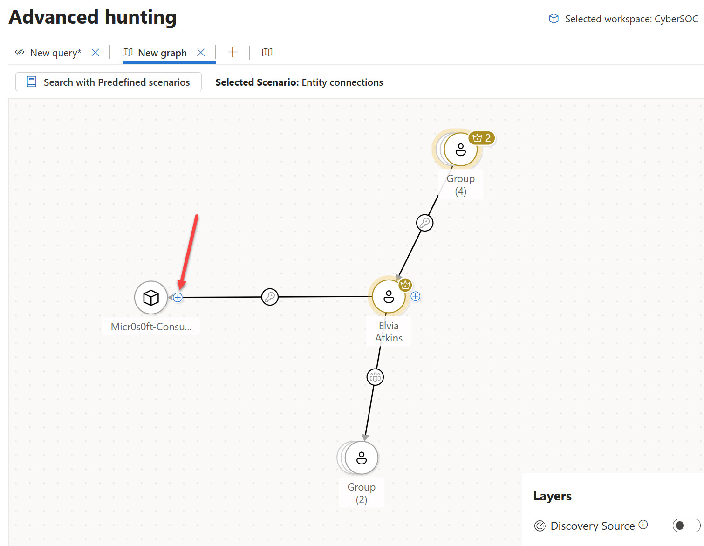

# Exercise 12 — Sentinel Graph: Blast Radius & Hunting Graph

**Difficulty:** Intermediate
**Prerequisites:** Microsoft Sentinel data lake onboarded · Microsoft Security Exposure Management (read) access

---

## Objective

Explore two advanced graph-based investigation capabilities built on the Microsoft Sentinel data lake and graph infrastructure:

1. **Blast Radius Analysis** — visualise the possible propagation paths of an active incident to critical assets in your environment.
2. **Hunting Graph** — interactively explore entity relationships and attack paths without writing KQL.

---

## Background

Traditional incident investigation relies on tabular query results and manually correlating entities. The Sentinel graph layer adds a relational model over your security data, enabling visual, node-and-edge exploration of how entities connect, which assets are reachable from a compromise, and where choke points exist.

| Capability | Where to find it | Core use case |
|---|---|---|
| Blast Radius Analysis | Incidents page → incident graph | Understand the current & potential future impact of an active breach |
| Hunting Graph | Advanced Hunting → graph icon | Proactively explore attack paths and entity relationships |

> **Note:** Blast radius analysis extends and replaces the earlier Attack path analysis feature. It is currently in preview.

---

## Prerequisites

Before starting, confirm the following are in place:

- Access to Zava public environment

---

## Part 1 — Blast Radius Analysis

### What it does

The blast radius graph generates an interactive visualisation of possible propagation paths from a compromised node to predefined critical targets. It shows **both pre-breach and post-breach information** in a single consolidated graph, letting you instantly understand:

- Which assets are already impacted
- Which critical assets could be reached if the attack continues
- What paths the attacker could take (up to 7 hops from the source node)

### Steps

#### 1.1 Open an incident

1. In your Zava public browser, go to [this incident](https://security.microsoft.com/incident2/44224/overview?tid=0527ecb7-06fb-4769-b324-fd4a3bb865eb)
2. The incident page opens with the **Attack story** tab active. You should see the incident graph populated with nodes representing devices, users, and alerts.

#### 1.2 Trigger blast radius from a node

1. In the incident graph, click on user **elviaa**.
2. Select **View blast radius**.
   - The graph expands to show propagation paths toward critical targets highlighted with risk indicators.
   
#### 1.3 Read the blast radius graph

Examine the graph and answer the following:

| Question | Your observation |
|---|---|
| What node is at the **centre** of the blast radius? | |
| How many **hops** separate the compromised node from the nearest critical target? | |
| Are any intermediate nodes flagged as **vulnerable** or **exposed to the internet**? | |
| What **critical targets** appear at the end of the propagation paths? | |

> **Note:** Only nodes and edges within your RBAC scope are visible. Paths containing out-of-scope nodes are hidden entirely.

#### 1.4 (Optional) Take action from the graph

1. Select an intermediate node along a propagation path.
2. From the context menu, review the available actions (e.g., **Isolate device**, **Go hunt**, **Disable user**).
3. Note which actions are available — these let you disrupt the attack path without leaving the investigation view.

#### 1.5 Hide blast radius

Select the original node again and choose **Hide blast radius** to return to the standard incident graph view.

#### 1.6 Get user details

The incident graph only provides the user's alias, but we don't have the user's name. 

1. Click on user **elviaa** and select **User details**.
2. The entity page for the user appears on the right and we can see it corresponds to user **Elvia Atkins**.
3. Take a not of this user name.

---

## Part 2 — Advanced Hunting Graph

### What it does

The hunting graph is a visual exploration layer within Advanced Hunting. Instead of writing KQL to find entity relationships, you select a **predefined scenario**, set a **seeding entity**, apply **filters**, and render an interactive node-and-edge graph.

Available scenarios:

| Scenario | What it answers | Required input |
|---|---|---|
| **Paths between two entities** | Is there a path from one entity to another? | Start entity + End entity |
| **Entities that have access to a key vault** | Which devices, VMs, containers, or servers have direct or indirect access to a key vault? | Target key vault |
| **Users with access to sensitive data** | Which users can access a specific sensitive data storage? | Target storage account |
| **Critical users with access to storage accounts containing sensitive data** | Which privileged users have access to storage resources containing sensitive data? | (None) |
| **Data exfiltration by a device** | What storage accounts can a given device access? | Source device |
| **Paths to a highly critical Kubernetes cluster** | Which users, VMs, and containers have access to a critical Kubernetes cluster? | Target Kubernetes cluster |
| **Identities with access to Azure DevOps repositories** | Which identities have read/write access to an ADO repository? | Target ADO repository |
| **Identify nodes in the highest number of paths to SQL data stores** | Which nodes appear most frequently on paths leading to SQL data stores? | (None) |
| **Attack paths to a critical asset** | What routes could an attacker take to reach a target via lateral movement? | Target critical asset |
| **Entity connections** | What is directly connected to this entity (incoming and outgoing)? | Source entity (any type) |

### Steps

#### 2.1 Navigate to the Hunting Graph

1. In the **Microsoft Defender portal**, go to **Investigation & response** → **Hunting** → **Advanced hunting**.
2. In the Advanced Hunting page, select the **Hunting graph icon** (graph icon in the toolbar next to the query editor). A new tab labelled **New hunt** opens.

#### 2.2 Explore attack paths to a critical asset

In the previous exercise about Blast Radius, we saw that user Elvia Atkins had access to a service principal, Let's now see more connections from that user.

1. Select **Search with Predefined scenarios**.
2. In the side panel that appears, select the **Entity connections** scenario.
3. Type **Elvia Atkins** as the start entity. 

#### 2.3 Apply filters

Refine the graph using the available filters:

| Filter | Example value | Purpose |
|---|---|---|
| **Show only the shortest paths** | Enabled | Reduces noise — shows the most direct attack routes |
| **Source Node** | Is vulnerable | Focus on paths that originate from vulnerable devices |
| **Edge Type** | `can authenticate as`, `has permissions to` | Show identity-based lateral movement edges |
| **Edge direction** | Outgoing | Show paths moving away from the source |

Leave filters at default for the first run.

#### 2.4 Render the graph

1. Select **Run**.
2. The graph renders with nodes (entities) and edges (relationships). Use the **Zoom in/Zoom out** controls in the lower-right corner to navigate.
3. You can see that the user is *member of* two groups and four groups "have a role" on this user. You can click on them to see more details, or right-click to extract all the nodes from a group
4. Let's now focus on the Entra App the user has a role on. Click the + ico to expand connections from that node

5. We can now see that the app *can authenticate* as a service principal, which is a tagged as a crown jewel.

This show you how an analyst can hunt for additional connections to/from the original entity.
---

## Key Takeaways

- **Blast radius analysis** integrates directly into incident investigation, providing pre- and post-breach propagation context without leaving the incident page
- **Path length is bounded at 7 hops** — blast radius is an approximation, not a guaranteed complete picture
- The **hunting graph** makes entity relationship exploration accessible without KQL, complementing tabular advanced hunting queries
- **Predefined scenarios** cover the most common investigative questions; filters refine the graph to reduce noise
- Both capabilities require the **Sentinel data lake** and **Exposure Management** permissions — ensure these are provisioned before the lab
- Graph quality improves with **critical asset classification** — encourage customers to define critical assets in Security Exposure Management as a baseline security posture task

---

## Next steps

Congratulations, you have completed this exercise! You can now continue to the next exercise:

- **[Exercise 13 — Creating a Custom Graph in Microsoft Sentinel](./E12_custom_graph.md)**

---

## Microsoft Learn References

- [Blast radius analysis — Investigate incidents in Microsoft Defender XDR](https://learn.microsoft.com/en-us/defender-xdr/investigate-incidents#blast-radius-analysis)
- [Advanced hunting graph in Microsoft Defender XDR](https://learn.microsoft.com/en-us/defender-xdr/advanced-hunting-graph)
- [Onboarding to Microsoft Sentinel data lake and graph](https://learn.microsoft.com/en-us/azure/sentinel/datalake/sentinel-lake-onboarding)
- [Review and classify critical assets — Security Exposure Management](https://learn.microsoft.com/en-us/security-exposure-management/classify-critical-assets)
- [Graph icons and visualizations in Microsoft Defender](https://learn.microsoft.com/en-us/defender-xdr/understand-graph-icons)

