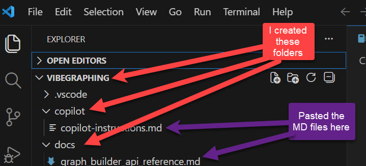
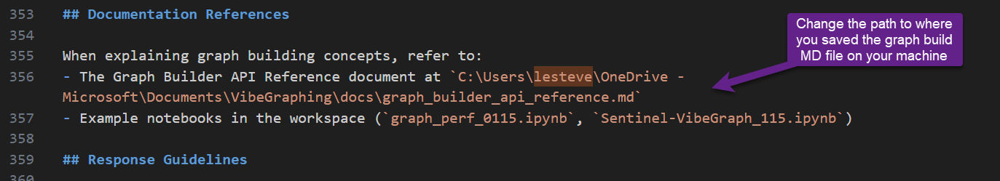
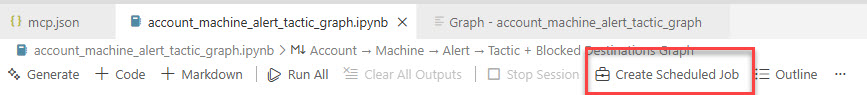
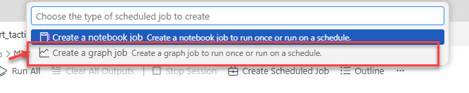
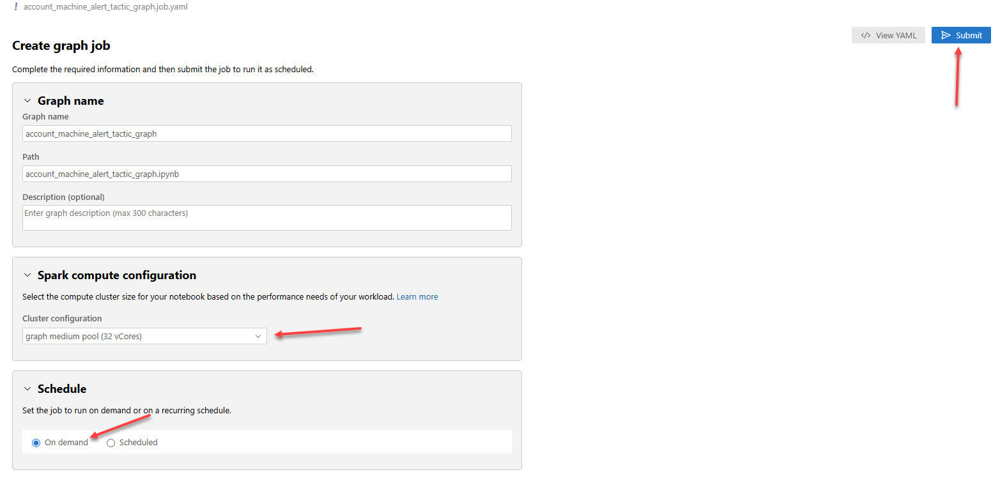
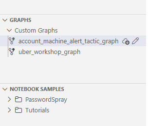
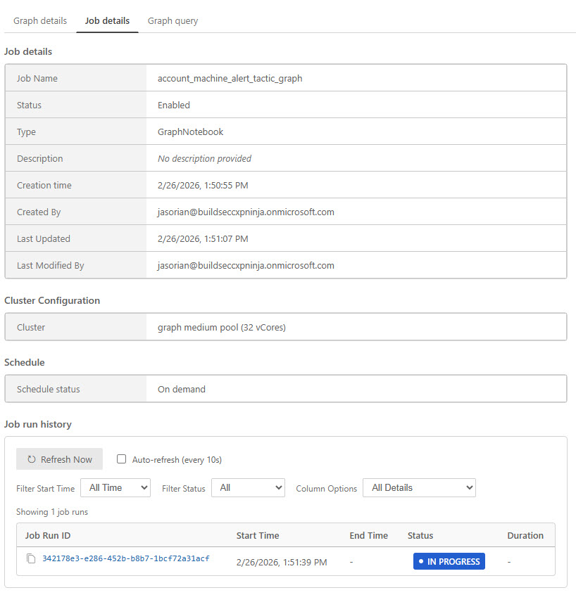

# Exercise 13 - Creating a Custom Graph in Microsoft Sentinel (Hands‑On, Step by Step)

As you saw in exercise 12, there are several native experiences to use Sentinel graph available in the Defender portal. However, users might want to be able to create their own custom graph representations for their own data.

This guide walks through how to create a **custom graph** in Microsoft Sentinel graph.  

> ⚠️ The setup is currently more manual, but this will become more “out-of-the-box” over time as the experience matures.

## Prerequisites

- GitHub Copilot setup in VSCode
- Signup for the Custom Graph and Graph MCP tools private preview [here](https://customervoice.microsoft.com/Pages/ResponsePage.aspx?id=v4j5cvGGr0GRqy180BHbR9i0TN7NE5lOkU0ftWbP3rlUMDkyWU9FRzJFV0dHTllPS0ZKUEhKSTZDVCQlQCN0PWcu) 

---

## 1. Setup

Follow these steps to get your environment ready:

- Open a new VSCode window and create a new folder called for this project. For example, "Vibe Graphing"
- Copy these two markdown files to your local machine
    - SDK API reference - [graph_builder_api_reference.md](../Artifacts/CustomGraph/graph_builder_api_reference.md)
    - Copilot instructions - [copilot-instructions.md](../Artifacts/CustomGraph/copilot-instructions.md). 
    
    - Open copilot-instructions.md file after you copy it locally and go to line 356. Change the path to point to your local copy of the graph builder doc from previous step(see image below)
    

These two files instruct GitHub Copilot how to create a custom graph using a Jupyter Notebook.

## 2. Create custom graph notebook

1. Open a new Github Copilot chat.
2. Write this prompt:

> *"Based on the data I have in Sentinel adminsoc workspace in the following tables OktaV2_CL, AWSCloudTrail, GCPAuditLogs, CrowdStrikeDetections, CrowdStrikeHosts, CrowdStrikeVulnerabilities, CommonSecurityLog, SEG_MailGuard_CL over the last day, create a graph notebook that maps relationships between user, devices, IP addresses and file hashes. Make sure that you query the data in each table to fully understand the table schema and entity extraction patterns. Please show me a plan before building it"*

3. GitHub Copilot will start building the notebook for you. This will take a few minutes.
4. Once it finishes, review the output and click "Keep" if you're happy with the results

## 3. Execute custom graph notebook

1. Go to File explorer and you should see a new notebook that has been created for you.
2. Review the different sections and identity these tasks:
    - Tables being loaded
    - Create nodes
    - Create edges
    - Build graph
3. Normally, you would execute this notebook locally to debug possible errors, but to make it faster, we will create a new graph job to execute now. Click on **Create Scheduled Job** just above the notebook

4. Select **Create a graph job**

5. A tab similar to the one below appears. Select **graph medium pool (32 vCores)** as the Cluster configuration
6. Under **Schedule**, select **On demand**. Click on **Submit** in the top right.

7.  After a minute or two, you will see your custom graph listed in the Microsoft Sentinel extension

8. Click on it and a new tab will open with all the job details. Navigate to **Job details** tab and you will see the job run history, where you can see the latest status. It will take around 30 minutes to fully execute

## 4. Run a graph query

Once your new custom graph is ready, you can query it withing VSCode:

---

## Next steps

Congratulations, you have completed all exercises in this lab! You've explored Microsoft Sentinel's full capabilities from incident investigation to custom graph building.
